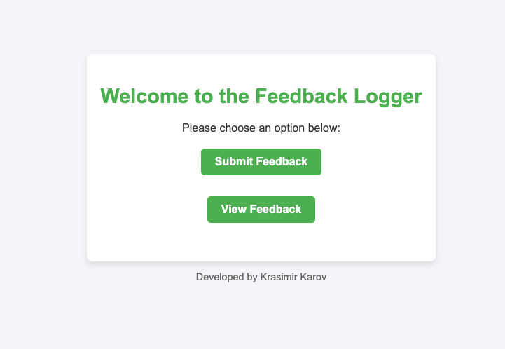

# A devops project to deploy a CRUD application to AWS EKS. 

> **_NOTE:_**  Currently building the docker containers on a Mac with M2 processor, so keep this in mind.

## Deployment
From the root dir:

``` shell
cd terraform
terraform init
terraform apply --auto-approve
```

This will provision the EKS cluster with 2 nodes and will assign your current AWS user/role as an admin.


From the root dir run the provision.sh script. 

> **_NOTE:_**  This will modify your kubectl context, so make a backup first!!!
``` shell
./provision.sh
```

This will build and populate the ECR repositories with the desired containers.
Then it will set up your kubectl connection, deploy the containers and the ALB. 
- feedback-db     1/1
- feedback-logger 2/2
- redis           1/1

After that it will echo the ALB FQDN to connect to. 
> **_NOTE:_**  It will take a few minutes for the ALB to route connection to the cluster. 


When you open the ALB FQDN in the browser you should be greeted by this:




## Application components:
I've already developed this application for another task, so I decided to directly reuse it. It consists of a database, cache and shared filesystem to store files on.

I've containerized it along with the PSQL database and am using a pure redis image.
The /var/lib/postgres directory is stored on an EBS Volume
The files that are uploaded as part of the feedback process are stored on an EFS Share. 

## Security
Security best practices are taken into account and could be even taken a step further by disabling public endpoint access and using only private endpoint access. 

Currently the var.allowed_ips is a cidr range with only my IP in it. Check out the terraform.tfvars.example file. 